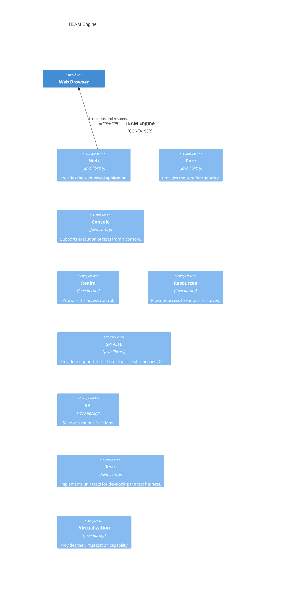

## TEAM Engine

### Overview 

TEAM Engine (Test, Evaluation, And Measurement Engine) is a Java-based application for 
testing web services and other information resources. It executes test suites developed 
using the popular TestNG framework, OGC Compliance Test Language (CTL) scripts, and possibly 
other JVM-friendly languages. It is lightweight and easy to run from the command-line or 
as a web application. 

TEAM Engine can be used to test almost any type of service or information resource. It is 
the official test harness used by the Open Geospatial Consortium's (OGC) [compliance program](https://www.ogc.org/resources/compliance/). 
Visit the [project documentation website](https://opengeospatial.github.io/teamengine/) 
for more information.

An installation is maintained by the OGC at https://cite.ogc.org/teamengine/.

### How to build

Java 17 and [Apache Maven](http://maven.apache.org/) 3.9 are required to build TEAM Engine.

* Clone the repository:

   `git clone https://github.com/opengeospatial/teamengine.git`

* Change to the directory containing the local repository:

   `cd teamengine`

* Execute the Maven install phase to add the build artifacts to the local repository:

   `mvn install`

### More information 

The following sources include documentation about how to install the tests, run TEAM Engine via the 
command line or as a web application in a Java servlet container.

* An extensive tutorial can be found in the [doc folder](https://github.com/opengeospatial/teamengine/blob/master/src/site/doc/en/index.rst). 

* A _Getting Started Guide_ is available at the [project documentation website](https://opengeospatial.github.io/teamengine/). 
This can also be created by generating the site documentation (which includes a PDF 
document in the target/pdf directory):

   `mvn site` 

### License

[Apache 2.0 License](LICENSE.txt)

### How to contribute

If you would like to get involved, you can:

* [Report an issue](https://github.com/opengeospatial/teamengine/issues) such as a defect or an 
enhancement request
* Help to resolve an [open issue](https://github.com/opengeospatial/teamengine/issues?q=is%3Aopen)
* Fix a bug: Fork the repository, apply the fix, and create a pull request
* Add a new feature: Fork the repository, implement (and test) the feature on a new topic 
branch, and then create a pull request

### Mailing Lists

The [cite-forum](https://lists.ogc.org/mailman/listinfo/cite-forum) is where software developers discuss issues 
and solutions related to OGC tests and TEAM Engine. 

Contributors are expected to observe the project's [code of conduct](https://github.com/opengeospatial/teamengine/blob/master/CODE_OF_CONDUCT.md).

### More Information

Visit the [CITE wiki](https://github.com/opengeospatial/cite/wiki) for more information about the 
CITE program and tools.

### TEAM Engine - High Level Architecture

